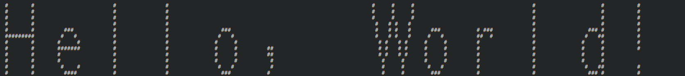
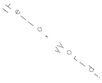

# Cedar (experiments and) tools


> [!WARNING]
> I'm documenting things I learned and adding more as I go along. Expect to see changes and corrections.

I got obsessed with the ideas of Alan Kay's mythical [Dynabook](https://en.wikipedia.org/wiki/Dynabook) and it's first incarnation, the [Alto](https://en.wikipedia.org/wiki/Xerox_Alto), years ago. That led me to explore without much depth of Smalltalk descendants, [Squeak](https://squeak.org/) and [Pharo](https://pharo.org/) and it lead knower. Last time my interest peaked again I went to look if anybody had done a FPGA implementation of the Alto, feels like it would be a bit of a challenge but maybe not as much as I believe, I found nothing. Not being able to work with hardware right now I got back to study Xerox PARC history and fix/translates some related wikipedia articles to the Portuguese language wikipedia. I then got interested in the other languages they used at the PARC, like [BCPL](https://en.wikipedia.org/wiki/BCPL) and [Mesa](https://en.wikipedia.org/wiki/Mesa_\(programming_language\)) and it's descendants [Cedar](https://en.wikipedia.org/wiki/Cedar_\(programming language\)) (name of the language and the environment).

Feel free to create an issue to ask questions and other things.

## Before anything... Emulators!

You shoud go try some full system emulators, most are courtesy of the [Living Computer Museum](https://en.wikipedia.org/wiki/Living_Computers:_Museum_%2B_Labs) R.I.P.

- Some information about the Alto and a emulator that runs inside the browser http://retroweb.maclab.org/articles/Xerox-Alto.html
- ContraAltoJS: port of the next Alto emulator to run inside the browser https://archives.loomcom.com/contraltojs/
- ContraAlto: an Alto emulator for dotnet and mono (like for Linux and other OSs that run Mono) https://github.com/livingcomputermuseum/ContrAlto
- Darkstar: an Xerox Dandelion workstation emulator for dotnet and mono (same as the above) https://github.com/livingcomputermuseum/Darkstar
- Dwarf, a Mesa machine architecture emulator for Xerox 6085 and Guam workstations https://github.com/devhawala/dwarf


## Research
I looked if any Mesa/Cedar compilers were available for modern systems but they all stuck on the Alto and it's D line of computers as far as I know. Frustratingly enough I never managed to compile anything on those machines.

I then looked if there was any BCPL compiler for Linux. The BCPL creator still mantes a compiler distribution at [https://www.cl.cam.ac.uk/~mr10/BCPL.html]() and it works, but only to generate intermediate code and run it, the binary compiler seems to be broken. I imagined I would find a version of the Mesa compiler written in BCPL and somehow get it to build and run on a modern computer but if there's on I haven't found it yet.

This is a BCPL reference manual from Xerox http://www.bitsavers.org/pdf/xerox/alto/bcpl/BCPL_Reference_Manual_Sep75.pdf

What I later found when looking for the C source code of one of the Cedar ports to Unix, was binaries for Sun Microsystems SunOS (the OS before Solaris) for the architecture sun4 like https://xeroxparcarchive.computerhistory.org/_cdcsl_93-16_/1/cedar/cdpackage/solaris2/.index.html. After looking for the particular version of SunOS those binaries were compiled for, SunOS 2.6 (aka Solaris 5.6), to try to increase my chances of success (and a archive.org hack/outage later) I found the installed ISO file **[TODO: link the internet achieve here]**. I did familiarized myself with SunOS and running it on QEmu using the _qemu-system-sparc_ emulator with (and I figured this out later when I got the Cedar environment to run) a particular flag *-cpu 'TI-SuperSparc-II,+float128'* (note we are adding *+float128* to what would be the default value for the -cpu flag). Turns out those binary files were part of a mostly functional version of Cedar. Besides telling QEmu to add a float point extension to the emulated Sparc CPU and after lot's of trial en error it was only necessary to rename the folders in https://xeroxparcarchive.computerhistory.org/_cdcsl_93-16_/1/cedar/release/.index.html since the capitalization of the names was lost when I downloaded them. You should be able to run the environment by replacing the custom X server that SunOS defaults to but I didn't try that and ran a Xephir nested X server on another machine.

**[TODO: try to find this update mentioned at wikipedia "Last update was Solaris 2.6 5/98."]**


I haven't managed to compile any Mesa/Cedar code using the Mimosa compiler yet.


https://xeroxparcarchive.computerhistory.org/_cdcsl_93-16_/1/ppcr/v1.13/.v1.12.README.html mentions plans for a Linux port of the portable Cedar runtime.

## How to build yourself a Sun (OS install)
Since most of us don't own a working (or not) SPARCstation you'll need to install a version of QEmu built with the SPARC emulator or install the package for it, something like *qemu-system-sparc* and also *qemu-utils* (to create an empty disk image). On a Debian based system should be enough to:

```bash
$ sudo apt install qemu-system-sparc qemu-utils
```

Download the install ISO from https://fsck.technology/software/Sun%20Microsystems/Solaris%20Install%20Media/Sun%20Solaris%202.6/Sun%20Solaris%202.6%2005-1998/ (this one marches the SHA1 hash of the ISO I believe I used)

**TODO: Check the other ISO files from the same site, and also check the internet archive images**

For now we will follow a guide I used. You can ignore the instructions about compiling QEmu and using the ROM file since you should be able to just use what QEmu provides, but this guide cover most of what you need to do https://astr0baby.wordpress.com/2018/09/22/running-solaris-2-6-sparc-on-qemu-system-sparc-in-linux-x86_64-mint-19/

> [!WARNING]
> The details about disk size, disk formatting and partition matter.

**TODO: Maybe document how to label (something SunOS requires) the disk on Linux as expected by SunOS before the installation if that was really possible to save one reboot. Add the how to mount a qcow2 image.**

> [!TIP]
> To be able to run the binaries I found and therefore run the Cedar system you must pass the flag *-cpu 'TI-SuperSparc-II,+float128'* when you call QEmu.

```bash
$ qemu-img create -f qcow2 sunos_26.qcow2 4G
$ qemu-system-sparc -M SS-20 -cpu 'TI-SuperSparc-II,+float128' -net nic,macaddr=00:03:BA:04:A5:AD -net user -m slots=4,maxmem=256M -cdrom solaris_2.6_598_sparc.iso -M SS-20 -vga cg3 -smp 2 -hda sunos_26.qcow2
```

### Bonus
In case you want to play around with [Forth](https://en.wikipedia.org/wiki/Forth_\(programming_language\)) you can boot one of the SPARCstation ROMS https://github.com/andarazoroflove/sparc and have a go with the *ok* prompt:

```bash
$ qemu-system-sparc -bios ss5.bin -M SS-5
```

You need to press the key Stop-A, and since we don't have a Sun keyboard, go on the menu View > compatmonitor0 or just press CTRL+ALT+2 and type *sendkey stop-a* then menu View > sun-tcg or CTRL+ALT+1 to go back. Try typing this at the *ok* prompt:

```forth
5 2 + 10 * .
```

Of course QEmu's included version of OpenFirmware is also a Forth prompt without the *ok* part so we can so that same without the proprietary firmware. Go check https://learnxinyminutes.com/docs/forth/ for a bit more.

## Getting your very own Cedar
Now that we have a "machine" running SunOS 2.6 we better backup the disk image by coping sunos_26.qcow2 to something like sunos_26.qcow2.back before we proceed. And then...

I'll later include instructions on how I manage to run a version of the Cedar system on SunOS from https://xeroxparcarchive.computerhistory.org/_cdcsl_93-16_/1/cedar/.index.html in the future. Maybe a script to run on SunOS (maybe there are no way to download anything, maybe you could install Netscape :raised_eyebrow: ...it does have that browser written in Java out of the box though)

Basically a recursive wget from the URL above but we can do a better than that, since we might need to rename the folders anyway we might as well put the download as part of a script. Check the Makefile to see the flags I'm using to download fonts.

> [!CAUTION]
> You need to set the environment variable **TODO: check if it's XEROXCEDAR or something**

**[TODO: find a way to keep the correct case or write a script to rename the folders correctly]**


## Other links

- Ken Shirriff's [Simulating a Xerox Alto with the ContrAlto simulator: games and Smalltalk](http://www.righto.com/2016/10/simulating-xerox-alto-with-contralto.html)
- Ken did manage to compile a hello world BCPL program on the Alto (emulator): ["Hello world" in the BCPL language on the Xerox Alto simulator](http://www.righto.com/2016/06/hello-world-in-bcpl-language-on-xerox.html)
- And of course the Alto Restoration playlist https://www.youtube.com/playlist?list=PL-_93BVApb58I3ZV67LW3S_JEMFnDrQDj where CuriousMark, Ken Shirriff and Carl Claunch fix Alan Kay's Alto, if I'm not mistaken.
- Pascal in Cedar (Mesa?) **TODO find link**

## Goal of this repo

This repository will holds some incomplete tools and experiments with code and fonts from Xerox PARC filesystem archive https://xeroxparcarchive.computerhistory.org/Xerox_PARC_source_code.html and documents my work.


## My goals
- [x] [Hello world in BCLP on the Alto](#hello-world-in-bcpl)
- [ ] Try to write a BCPL program that parses the AL font
- [ ] Understand how to handle the font formats AL and STRIKE and maybe find some good tool to write clear binary file parsers/readers
- [x] [Tool to convert PIC files to something modern](#tool-to-convert-pic-files-to-something-modern)
- [ ] Smallest QEmu disk image that can fit Cedar
- [ ] Hello world in Mesa
- [ ] Hello world in Cedar
- [ ] HTTP server maybe? :raised_eyebrow:
- [ ] Get Mimosa to generate C code that compiles and run Linux :exploding_head:
- [ ] Compile Cedar for Linux :exploding_head:

## Goal details

### Hello world in BCPL

Thanks to http://www.righto.com/2016/06/hello-world-in-bcpl-language-on-xerox.html

```c
// Hello, World!
get "streams.d"
external
[
  Ws
]

let Main() be
[
  Ws("Hello, World!*N")
]
```


### Bravo fonts and the AL font format

This PDF describes various font formats used by the Alto http://www.bitsavers.org/pdf/xerox/alto/printing/AltoFontFormats_Oct1980.pdf

What are AL files? They are bitmap font files with a minimal hearder and 337b (255 in octal) "self-relative pointers table for the corresponding ASCII charactes code" followd by entries for extension characters. The documentation presents the following BCPL language *structures*:

```c
structure AL:
  [
  Height word         // Height of the font (scan-lines)
  proportional bit    // True if proportional font
  baseline bit 7      // (see bellow)
  maxWidth bit 8      // Width of the widest character
  pointers ↑0,nCharsX // Self-relative pointers to XW entries
  charData word howEverMany
  ]

structure XHdata:
  [
  bitData word XH // Top scan-line first
  XW word         // (see bellow)
  HD byte         // (see bellow)
  XH byte         // Number of scan-lines of bit data
  ]
```

~~Sounds simple enouth but even if you get what is meant by "self-relative pointers" they don't seem to line up with the bitmaps down file. Also note (by interpreting the documentation or looking at bitmaps) that not all charactes are the same height. It took me embarassingly too long to notice that the "self-relative pointers" are supposed to point to XW entry of the XHdata structure. That way you have to look backwars XH words to find the first scanline. Even then I still can't line up the pointers with the XHdata. Also, it seem that it's important to locate the "dummy" charData, the one where XW = 1, XH = 0, HD = 0, it definately marks the end of the pointer table and the begining of the XHdata array. Still no luck interpreting the pointer value for example for the capital 'A' character in a way that I can directly find it's XHdata directly.~~

~~[TODO: Figure it out if the unalignment is due to the mechanism that omits the all zeros scanlines]~~

[TODO: Figure out and explain the wider character logic]

You can downloads the fonts used by the [Bravo](https://en.wikipedia.org/wiki/Bravo_\(editor\)) editor from https://xeroxparcarchive.computerhistory.org/indigo/bravox/fonts/.index.html by calling:

```bash
$ make download_bravox_fonts
```

but for now let's use the Alto fonts since I'm under suspicion that the format might have changed since that documentation was written.
```bash
$ make download_altofonts_original
```

Then use for example:

```bash
$ python3 read_al_font.py 'Fonts/Helvetica14.al\!2'
```

To see an "ASCII" art representation of the font. You can check how to do somthing smiliar using Gimp down bellow when I looked at the PIC image format. Note that this prints all byetes/pixels of the font after the header (and techinically some of it), we are not looking doing anything smart about the charactes like being able to locate where the bitmap for "#" is or put toguether charactes wider than 16 pixels.

You can also make and run print\_al\_font.c to see information about a font, by default it prints the header, the pointers and 127 ASCII characters in that font as ASCII art, it's kind of a mess right now:

```bash
$ make
$ ./print_al_font Fonts/Splunk14.AL\!2
```

To see some text using a font you can:

```bash
./print_al_font -text "Hello World!" Fonts/Helvetica16.al\!2
```



You should get a .pbm image file inside *Fonts/* with the same name of the font but it's not properly working right now, so here a compromise for now:



If you can ignore that the terminal prints some of the characters byte-reversed, now the .pbm file looks fine, I present you Helvetica16:


And Classic14:


I added a ImHex pattern file for AL files at [./ImHex_pattern_files/al_font.hexpat](ImHex_pattern_files/al_font.hexpat), it probably could be better and more useful.


### Tool to convert PIC files to something modern
A PIC file is a bitmap image file with a simple header. You can use the ImHex pattern file [./ImHex_pattern_files/pic.hexpat](ImHex_pattern_files/pic.hexpat) to see the simple header structure of a PIC file, it has three words(2 bytes) in big endian encoding for width, height and an extra word that I haven't figured out the meaning, and the rest of bytes in the file are.

[Gimp](https://www.gimp.org/) was pretty useful after I discovered it open files of the type "Raw image data", once you click in open you have to select Image type as "B&W 1 bit", set the offset to 6 (to skip the header) and if you know the width of the image by openning with ImHex set the width, rounded you to a multiple of 16 because the bits/pixels are stored in full words of 16 bits, or guess sliding the value until the image makes sense. You will want to use the menu Colors > Invert. Note that after inverting the colors you might get a black bar on the right, that's na artifact of the bits being stored as 16 bits words. This same trick can be used to have a look at the .al fonts too.

Next I considered writing a script to automate Gimp or a Python script to use Pillow, but I remembered about the old image file formats PBM I played with a long time ago https://en.wikipedia.org/wiki/Netpbm#File_formats, the .pbm file is very similar to PIC, the difference is that it has a ascii header instead, so I wrote [pic_to_pbm.py](pic_to_pbm.py) to replace the header and now we have something that can be open by a lot of programs and you can convert using the programs from [Netpbm](https://netpbm.sourceforge.net/doc/pbm.html), to be exact *pam_to_png* to convert it PNG. The .pbm file should be viwable with many software but nothing beats PNG for widespread support.

```bash
$ python3 ../pic_to_pnm.py elf.pic\!1 elf.pbm
$ pamtopng elf.pbm > elf.png
```


> [!NOTE]
> The "!2" in the end of the font files is an artefact of the versioning system used by the archives, the two means it is the second version of that particular file.

> [!NOTE]
> There's a lot of documentation in the archives and at bitsavers.org and probably copies of the Cedar environment source code out there besides the one at the Computer History Museum, like this one at the internet archive https://archive.org/details/bitsavers_xeroxparcteriencesCreatingaPortableCedar_1335085/page/n3/mode/2up they just need to be studied systematically.

> [!CAUTION]
> I don't guarantee all information here is precise and correct and I welcome corrections.
