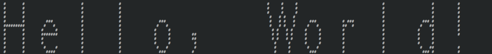
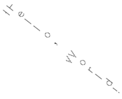
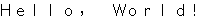
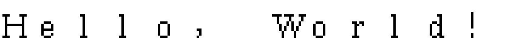

# Bravo fonts and the AL font format

This PDF describes various font formats used by the Alto http://www.bitsavers.org/pdf/xerox/alto/printing/AltoFontFormats_Oct1980.pdf

What are AL files? They are bitmap font files with a minimal hearder and 337b (255 in octal) "self-relative pointers table for the corresponding ASCII charactes code" followd by entries for extension characters. The documentation presents the following BCPL language *structures*:

```c
structure AL:
  [
  Height word         // Height of the font (scan-lines)
  proportional bit    // True if proportional font
  baseline bit 7      // (see bellow)
  maxWidth bit 8      // Width of the widest character
  pointers ↑0,nCharsX // Self-relative pointers to XW entries
  charData word howEverMany
  ]

structure XHdata:
  [
  bitData word XH // Top scan-line first
  XW word         // (see bellow)
  HD byte         // (see bellow)
  XH byte         // Number of scan-lines of bit data
  ]
```

~~Sounds simple enouth but even if you get what is meant by "self-relative pointers" they don't seem to line up with the bitmaps down file. Also note (by interpreting the documentation or looking at bitmaps) that not all charactes are the same height. It took me embarassingly too long to notice that the "self-relative pointers" are supposed to point to XW entry of the XHdata structure. That way you have to look backwars XH words to find the first scanline. Even then I still can't line up the pointers with the XHdata. Also, it seem that it's important to locate the "dummy" charData, the one where XW = 1, XH = 0, HD = 0, it definately marks the end of the pointer table and the begining of the XHdata array. Still no luck interpreting the pointer value for example for the capital 'A' character in a way that I can directly find it's XHdata directly.~~

~~[TODO: Figure it out if the unalignment is due to the mechanism that omits the all zeros scanlines]~~

[TODO: Figure out and explain the wider character logic]

You can downloads the fonts used by the [Bravo](https://en.wikipedia.org/wiki/Bravo_\(editor\)) editor from https://xeroxparcarchive.computerhistory.org/indigo/bravox/fonts/.index.html by calling:

```bash
$ make download_bravox_fonts
```

but for now let's use the Alto fonts since I'm under suspicion that the format might have changed since that documentation was written.
```bash
$ make download_altofonts_original
```

Then use for example:

```bash
$ python3 read_al_font.py 'Fonts/Helvetica14.al\!2'
```

To see an "ASCII" art representation of the font. You can check how to do somthing smiliar using Gimp down bellow when I looked at the PIC image format. Note that this prints all byetes/pixels of the font after the header (and techinically some of it), we are not looking doing anything smart about the charactes like being able to locate where the bitmap for "#" is or put toguether charactes wider than 16 pixels.

You can also make and run print\_al\_font.c to see information about a font, by default it prints the header, the pointers and 127 ASCII characters in that font as ASCII art, it's kind of a mess right now:

```bash
$ make
$ ./print_al_font Fonts/Splunk14.AL\!2
```

To see some text using a font you can:

```bash
./print_al_font -text "Hello World!" Fonts/Helvetica16.al\!2
```



You should get a .pbm image file inside *Fonts/* with the same name of the font but it's not properly working right now, so here a compromise for now:



If you can ignore that the terminal prints some of the characters byte-reversed, now the .pbm file looks fine, I present you Helvetica16:



And Classic14:



I added a ImHex pattern file for AL files at [../ImHex_pattern_files/al_font.hexpat](ImHex_pattern_files/al_font.hexpat), it probably could be better and more useful.
